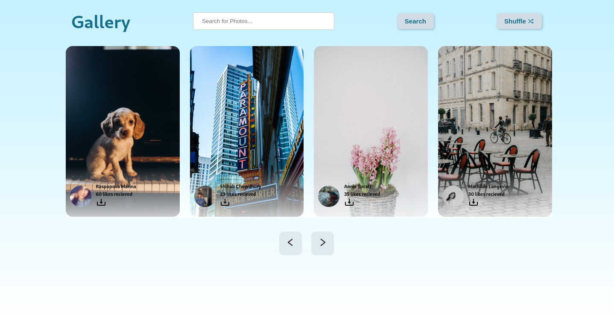

<h1 align="center">Its a Scrollable Gallery!!! You can search your favarite imgaes and see who click the photograph too!!!</h1>

<h2 align="center">

</h2>

<p>&nbsp;</p>

<p>
  
  
  
  <a href="https://github.com/marpit19/Jujutsu-Kaisen-API/blob/main/README.md" target="_blank">
    
  </a>
  <a href="https://github.com/marpit19/Attack-on-Titan-API/graphs/commit-activity" target="_blank">
    
  </a>
  <a href="#" target="_blank">
    
  </a>
  <a href="https://twitter.com/k1llua2k" target="_blank">
    
  </a>
</p>

### ✨ [Demo](https://scrollable-gallery.vercel.app/)

## Prerequisites

- npm 8.4.1
- node 17.0.0
- reactjs

## Install

```sh
yarn install/npm install
```

## Author

👤 **Arpit Mohapatra**

* Website: https://arpit-mohapatra.vercel.app/
* Twitter: [@k1llua2k](https://twitter.com/k1llua2k)
* Github: [@marpit19](https://github.com/marpit19)

## Show your support

Give a ⭐️ if this project helped you!

[](https://forthebadge.com)
